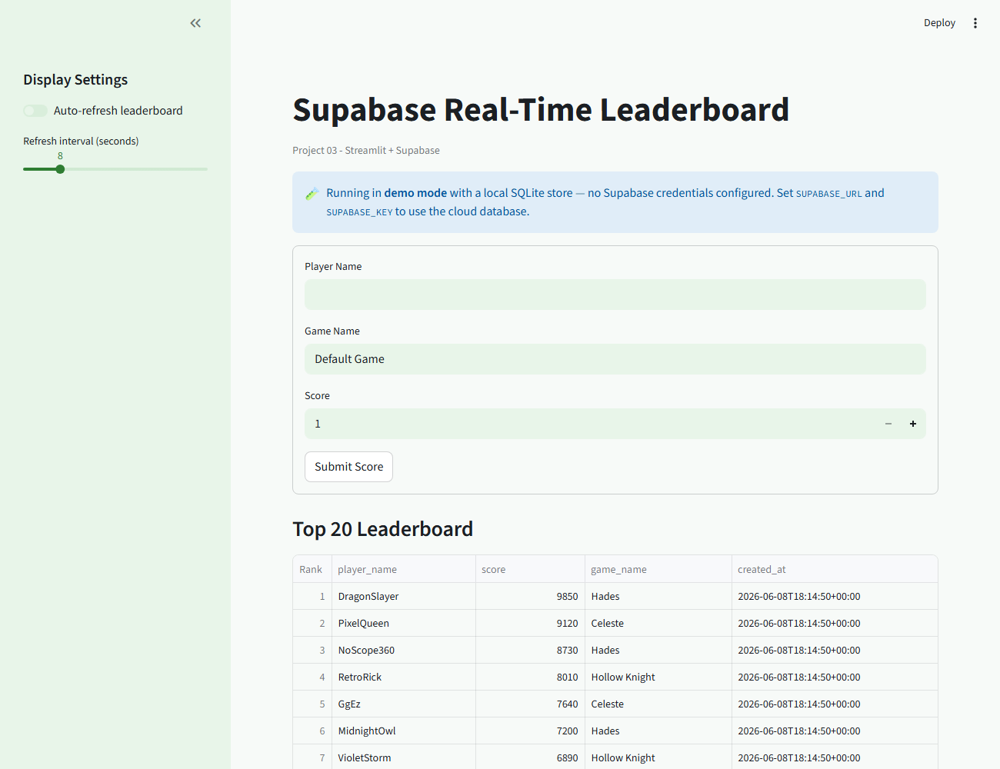

# Supabase Real-Time Leaderboard

Project 03 from the portfolio BRD. This app uses Streamlit for the UI and Supabase for cloud PostgreSQL persistence.

## Features

- Submit player name, game name, and score
- Store records in Supabase table: leaderboard (PostgreSQL)
- Render top 20 scores sorted by score descending
- Enforce positive score validation (client- and DB-side `CHECK`)
- Auto-refresh leaderboard for near real-time updates
- **Demo mode**: runs against a local SQLite store when no Supabase credentials
  are set — so you can try it instantly with zero cloud setup

## Demo mode (no account needed)

If `SUPABASE_URL` / `SUPABASE_KEY` are not configured, the app transparently falls
back to a local SQLite store (`src/local_store.py`) and shows a demo-mode banner.
This is how the screenshot above was produced. Set the two environment variables to
switch to the real Supabase cloud database — no code changes required.

## Real-time updates

Streamlit reruns top-to-bottom on each interaction, so this app uses
`streamlit-autorefresh` to re-poll the top-20 on a short interval (the
Streamlit-friendly equivalent of a live subscription). The same `leaderboard` table
also has Supabase Realtime available if you enable it in the dashboard.

## Tech Stack

- Streamlit
- supabase-py
- python-dotenv

## Setup

1. Create and activate your virtual environment.
2. Install dependencies:
   pip install -r requirements.txt
3. Copy environment template:
   copy .env.example .env
4. Add your Supabase values to .env:
   SUPABASE_URL=your_project_url
   SUPABASE_KEY=your_anon_key
5. Ensure your Supabase table exists using sql/schema.sql.
6. (Optional local convenience) copy Streamlit secrets template:
   copy .streamlit\secrets.toml.example .streamlit\secrets.toml

## Run

streamlit run app.py

## Streamlit Cloud Deployment

1. Push this repository to GitHub.
2. In Streamlit Community Cloud, create a new app from this repo.
3. Set main file path to: app.py
4. In app settings, add Secrets:
   SUPABASE_URL = your project URL
   SUPABASE_KEY = your anon key
5. Deploy.

## Security Notes

- Never commit .env or .streamlit/secrets.toml.
- If a key is accidentally shared publicly, rotate it in Supabase.
- Enable RLS and strict policies before public launch.

## Schema & Row-Level Security

`sql/schema.sql` creates the `leaderboard` table (UUID PK, positive-score `CHECK`,
score/created_at index) and enables **Row-Level Security** with policies that allow
public `select` and `insert` only — updates and deletes are not exposed through the
API, which is the correct posture for an open, append-only leaderboard.

## File Structure

- app.py
- src/db.py
- src/leaderboard.py
- src/local_store.py        (local SQLite demo backend)
- sql/schema.sql
- docs/dataflow.md
- docs/leaderboard_screenshot.png
- .streamlit/config.toml
- .streamlit/secrets.toml.example
- tests/test_leaderboard.py

## Security Note

Never commit .env to Git. Keep your project keys in environment variables only.
